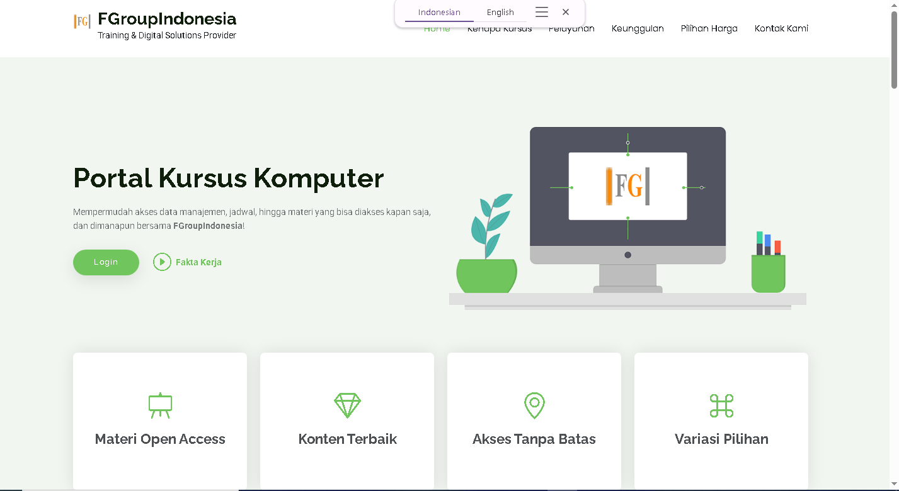

-----

## 🚀 Portal F-Group Indonesia: Jembatan Karier Digital Bangsa

**portal.fgroupindonesia.com** adalah **E-Platform Pembelajaran Digital** yang didedikasikan untuk memberdayakan seluruh warga negara Indonesia. Visi kami adalah menjembatani kesenjangan keterampilan dan menjadikan setiap pengguna sebagai **kandidat terbaik** yang siap bersaing di pasar kerja, baik secara lokal maupun global, melalui kursus dan pelatihan berkualitas tinggi.

-----




## ✨ Fitur Utama

### 💡 Visi & Dampak Sosial

  * **Akses Universal:** Menyediakan akses mudah ke pelatihan karier yang relevan bagi seluruh lapisan masyarakat Indonesia.
  * **Kandidat Terbaik:** Fokus pada pengembangan keterampilan *hard skill* dan *soft skill* yang dibutuhkan industri saat ini.
  * **Jembatan Karier:** Menghubungkan peserta kursus dengan peluang kerja dan pengembangan profesional.

### 💻 Teknologi & Arsitektur

  * **Kerangka Kerja Modern:** Dibangun di atas **CodeIgniter 4 (CI4)**, memastikan performa cepat, arsitektur yang bersih (MVC), dan kemudahan pemeliharaan.
  * **Keamanan Tingkat Tinggi (High Security):** Implementasi praktik keamanan terbaik untuk melindungi data pengguna dan integritas platform. Ini mencakup:
      * **Pencegahan Serangan Umum:** Proteksi terhadap *SQL Injection*, *Cross-Site Scripting (XSS)*, dan *CSRF*.
      * **Validasi Data Ketat:** Proses validasi *input* dan *output* yang komprehensif.
      * **Pengelolaan Sesi Aman:** Penerapan sesi yang kuat dan terenkripsi.
  * **Responsif Penuh (Mobile-Friendly):** Desain *User Interface* (UI) yang sepenuhnya responsif, memastikan pengalaman belajar yang optimal dan konsisten di semua perangkat, mulai dari desktop hingga *smartphone*.
  * **Basis Data Efisien:** Penggunaan sistem manajemen basis data yang teroptimasi untuk kecepatan akses dan skalabilitas data pengguna yang besar.

-----

## 🛠️ Instalasi Lokal

Untuk menjalankan proyek ini secara lokal, ikuti langkah-langkah berikut:

### 1\. Persyaratan Sistem

  * **PHP:** Versi 7.4+ atau lebih tinggi.
  * **Composer:** Diperlukan untuk mengelola dependensi.
  * **Web Server:** Apache atau Nginx.
  * **Basis Data:** MySQL/MariaDB.

### 2\. Langkah-Langkah

1.  **Clone Repositori:**

    ```bash
    git clone https://github.com/gumuruhsspj/portal.fgi.git portal.fgroupindonesia
    cd portal.fgroupindonesia
    ```

2.  **Instal Dependensi (via Composer):**

    ```bash
    composer install
    ```

3.  **Konfigurasi Environment:**

      * Duplikat file `env` menjadi `.env`.
      * Edit file `.env` dan atur `app.baseURL` dan kredensial basis data (`database.*`).

    <!-- end list -->

    ```ini
    # .env
    app.baseURL = 'http://localhost:8080'
    database.default.hostname = 'localhost'
    database.default.database = 'nama_db_anda'
    database.default.username = 'user_db_anda'
    database.default.password = 'password_db_anda'
    ```

4.  **Migrasi Basis Data:**

    ```bash
    php spark migrate
    ```

5.  **Jalankan Server Lokal (Opsional, menggunakan built-in server CI4):**

    ```bash
    php spark serve
    ```

    Akses aplikasi melalui URL yang ditampilkan di terminal (misalnya, `http://localhost:8080`).

-----

## 🤝 Kontribusi

Kami menyambut kontribusi dari komunitas\! Jika Anda menemukan *bug* atau memiliki ide fitur baru, silakan:

1.  *Fork* proyek ini.
2.  Buat *branch* baru (`git checkout -b feature/AmazingFeature`).
3.  *Commit* perubahan Anda (`git commit -m 'Add some AmazingFeature'`).
4.  *Push* ke *branch* (`git push origin feature/AmazingFeature`).
5.  Buka **Pull Request**.

-----

## ✉️ Kontak

Untuk pertanyaan atau dukungan lebih lanjut, silakan hubungi tim pengembang di:

  * **Email:** [support@fgroupindonesia.com]
  * **Website:** fgroupindonesia.com

-----

## 📜 Lisensi

Proyek ini dilisensikan di bawah GPL-3.0 License!

-----
 